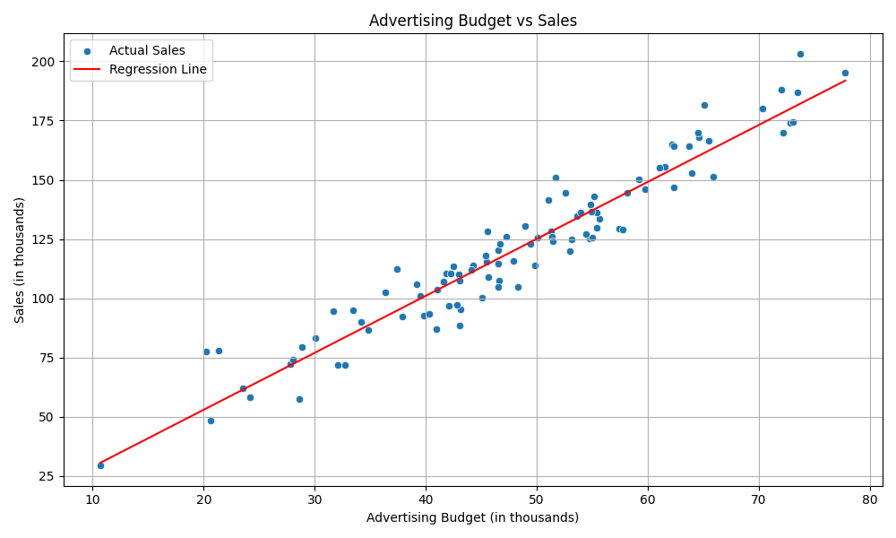

# Visualizing Correlations: Do Advertising Budgets Drive Sales?

## Introduction
In this blog post, I will explain the basics of linear regression. I will provide simple code that can be used to plot your own scatterplots and calculate correlations at home or for a simple project at work. I will also tell you how you can interpret variable relationships using correlation. Linear regression is a simple tool used to see if two different things (often referred to as *variables*) have a relationship. These “things” can be anything! It could be the level of stress someone experiences and its relationship to how much work there is at one’s school or job, or, in our example today, whether the amount spent in our advertising budget has a relationship with how many sales are made.

> **Note:** The data used today was randomly generated by a computer. This data in no way indicates the relationship between Advertising Budget and Sales and should not be used in any way other than to demonstrate how to use linear regression in Python.

## Tidy Data
One of the most important things you can do for yourself is to have tidy data. Depending on how your data is given to you, it can make the whole coding process exponentially easier. While we will not go into how to create tidy data in this blog post, know that if you have data in a format where you have a clear x and y variable, it will make your life a lot easier.

## Python Packages
We will be using five different Python packages in our code. I will list what they are and briefly explain what we will be using them for. Know that there is much more to each of these packages, but since we are learning about the simple linear regression model and not about packages themselves, I will briefly explain what they are used for. 

- `pandas` was used to organize and manipulate the data.  
- `seaborn` was used to create visualizations like scatterplots and regression lines.  
- `matplotlib.pyplot` was used to customize and save our plots.  
- `scipy.stats` was used to calculate the correlation coefficient.  
- `sklearn.linear_model` was used to fit and interpret the linear regression model.  

> **Note:** `numpy` is another package used in the code, but it was simply used to create the data. You shouldn’t need it otherwise.

## Simple Linear Regression
Linear regression is used to show the relationship between two variables—how your *x* variable affects your *y* value. Below is the simple linear regression equation:

$$
\hat{y} = \beta_0 + \beta_1 x
$$

If you remember your algebra class, you might notice that it appears to be the equation of a line. You would be correct. Linear regression is centered around this line equation. When we perform simple linear regression, we fit data to a *best-fit line.* Using this line, we are then able to see a quantifiable relationship between our two values based on our data. We can even predict what our given *y* would be if we had an *x* value we were curious about. This is where the power of linear regression comes into play, especially for data-driven decisions made by companies. The only limitation of our linear regression model is if the *x* value we desire to calculate is below our minimum or above our maximum *x* value.

### Slope and Intercept
The equation for linear regression doesn’t mean much if we can’t explain the two other values in the equation.  

- $$\beta_1$$ is the *slope* of our line. It is found using the equation below:

$$
\beta_1 = \frac{\sum_{i=1}^{n} (x_i - \bar{x})(y_i - \bar{y})}
{\sum_{i=1}^{n} (x_i - \bar{x})^2}
$$

Here, $$\bar{x}$$ is the average of all the *x* values in the sample, and $$\bar{y}$$ is the average of the *y* values.  
$$x_i$$ is an individual *x* value, and $$y_i$$ is the corresponding *y* value.  

- The *intercept* of the line is $$\beta_0$$. It is found using the equation below:

$$
\beta_0 = \bar{y} - \beta_1 \bar{x}
$$

## Coding a Graph in Python
This is how you would code a simple linear regression model using Python.

### Step 1: Start with your packages
```python
import pandas as pd
# numpy is not needed unless you want to create your own data
import numpy as np
import seaborn as sns
import matplotlib.pyplot as plt
from scipy.stats import pearsonr
from sklearn.linear_model import LinearRegression
```


### (This was the code used to create the data.)
```python
n = 100
advertising_budget = np.random.normal(loc=50, scale=15, size=n)
sales = 2.5 * advertising_budget + np.random.normal(loc=0, scale=10, size=n)
```

### Step 2: Create Data Frame using pd.DataFrame('<x-axis title>':x value, '<y-axis title>':y value)
```python
df = pd.DataFrame({
    'Advertising Budget (in thousands)': advertising_budget,
    'Sales (in thousands)': sales
})
```

### Step 3: Create your model using code below
```python
model = LinearRegression()
# Use model.fit(df[['<x-axis title>']], df['<y-axis title>'])
model.fit(df[['Advertising Budget (in thousands)']], df['Sales (in thousands)'])
# df['<Predicted (whatever you want)>']=model.predict(df[['<x-axis title>']])
df['Predicted Sales'] = model.predict(df[['Advertising Budget (in thousands)']])
```

### Step 4: Plot Scatterplot with regression line using code below
```python
# set figure size
plt.figure(figsize=(10, 6))
# plug in x and y accordingly
sns.scatterplot(data=df, x='Advertising Budget (in thousands)', y='Sales (in thousands)', label='Actual Sales')
sns.lineplot(data=df, x='Advertising Budget (in thousands)', y='Predicted Sales', color='red', label='Regression Line')
# modify title and x and y names on the graph
plt.title('Advertising Budget vs Sales')
plt.xlabel('Advertising Budget (in thousands)')
plt.ylabel('Sales (in thousands)')
# other aesthetic things
plt.legend()
plt.grid(True)
plt.tight_layout()
```
This code gives the following graph:


## Correlation Coefficient
The correlation coefficient is a number that tells you how strong the relationship is between your two variables. It is found using the pearsonr function from the scipy.stats package. The correlation coefficient is a number between -1 and 1. A correlation of 1 means that there is a perfect positive linear relationship between the two variables. A correlation of -1 means that there is a perfect negative linear relationship between the two variables. A correlation of 0 means that there is no linear relationship between the two variables. It is rare to have a correlation of exactly 1 or -1 in real life data, but the closer you are to those numbers, the stronger the relationship is.

The equation for the correlation coefficient is below:

$$
r = \frac{\sum_{i=1}^{n} (x_i - \bar{x})(y_i - \bar{y})}
{\sqrt{\sum_{i=1}^{n} (x_i - \bar{x})^2} \sqrt{\sum_{i=1}^{n} (y_i - \bar{y})^2}}
$$

You can calculate the correlation coefficient using the following code.

```python
correlation, _ = pearsonr(df['Advertising Budget (in thousands)'], df['Sales (in thousands)'])
```
This code returns a correlation of approximately 0.97, indicating a very strong positive linear relationship between advertising budget and sales in this example.

## Conclusion
In conclusion, linear regression is a powerful tool that can help you understand the relationship between two variables. By fitting a best-fit line to your data, you can quantify how changes in one variable may affect another. The correlation coefficient further aids in assessing the strength and direction of this relationship. With the provided Python code, you can easily implement linear regression and visualize the results, making it a valuable skill for data analysis in various fields. Whether you're working on academic research or business analytics, mastering linear regression will enhance your ability to make informed decisions based on data. 

Try the code about using your own data! It is easier than you think.

Thank you for reading my blog post! If you have any questions or comments, feel free to reach out.
